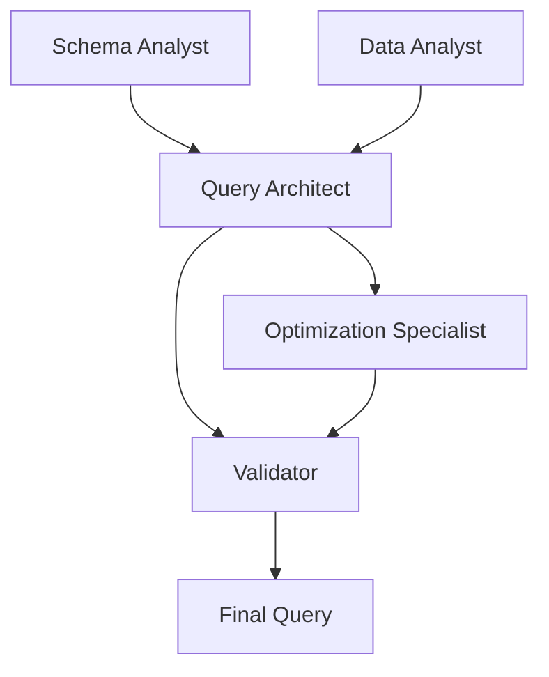

## Overview

The Database benchmark evaluates multi-agent collaboration on **database management and SQL query tasks**. It contains **100 tasks** covering diverse database scenarios from music streaming platforms to healthcare systems, testing agents' ability to generate complex SQL queries through collaborative analysis.

## Task Characteristics

### Agent Configuration
- **Number of Agents**: 5
- **Agent Roles**: Database specialists with complementary expertise
- **Collaboration Mode**: Graph-based collaborative query generation
- **Relationship Type**: Full peer collaboration (all agents collaborate)

### Environment
- **Type**: Database Environment
- **Database**: PostgreSQL
- **Max Iterations**: Variable (typically 10-20)
- **Tools**: SQL execution, schema analysis, query optimization

## Database Domains

The 100 database tasks span multiple application domains:

### 1. Entertainment & Media (20 tasks)
- Music streaming platforms
- Video streaming services
- Social media networks
- Content management systems

### 2. E-Commerce & Business (20 tasks)
- Online retail systems
- Supply chain management
- Inventory tracking
- Customer relationship management

### 3. Healthcare (15 tasks)
- Hospital management systems
- Patient records
- Appointment scheduling
- Medical billing

### 4. Education (15 tasks)
- Learning management systems
- Student enrollment
- Course management
- Grade tracking

### 5. Finance (15 tasks)
- Banking systems
- Transaction processing
- Account management
- Payment tracking

### 6. Technology & IoT (15 tasks)
- IoT device management
- Cloud file storage
- Smart home systems
- Sensor data management

## Database Schema Examples

### Task 1: Music Streaming Platform

<Accordion title="View Complete Schema">

```sql
-- Users table
CREATE TABLE users (
    user_id SERIAL PRIMARY KEY,
    username VARCHAR(50) UNIQUE NOT NULL,
    first_name VARCHAR(100),
    last_name VARCHAR(100),
    email VARCHAR(255) UNIQUE NOT NULL,
    password VARCHAR(255) NOT NULL,
    created_at TIMESTAMP DEFAULT CURRENT_TIMESTAMP
);

-- Artists table
CREATE TABLE artists (
    artist_id SERIAL PRIMARY KEY,
    name VARCHAR(255) NOT NULL,
    bio TEXT,
    created_at TIMESTAMP DEFAULT CURRENT_TIMESTAMP
);

-- Albums table
CREATE TABLE albums (
    album_id SERIAL PRIMARY KEY,
    artist_id INT REFERENCES artists(artist_id),
    title VARCHAR(255) NOT NULL,
    release_date DATE,
    genre VARCHAR(100),
    created_at TIMESTAMP DEFAULT CURRENT_TIMESTAMP
);

-- Songs table
CREATE TABLE songs (
    song_id SERIAL PRIMARY KEY,
    album_id INT REFERENCES albums(album_id),
    title VARCHAR(255) NOT NULL,
    duration INT,  -- in seconds
    track_number INT,
    created_at TIMESTAMP DEFAULT CURRENT_TIMESTAMP
);

-- Playlists table
CREATE TABLE playlists (
    playlist_id SERIAL PRIMARY KEY,
    user_id INT REFERENCES users(user_id),
    name VARCHAR(255) NOT NULL,
    description TEXT,
    is_public BOOLEAN DEFAULT TRUE,
    created_at TIMESTAMP DEFAULT CURRENT_TIMESTAMP
);

-- Playlist_songs table (junction)
CREATE TABLE playlist_songs (
    playlist_id INT REFERENCES playlists(playlist_id) ON DELETE CASCADE,
    song_id INT REFERENCES songs(song_id),
    added_at TIMESTAMP DEFAULT CURRENT_TIMESTAMP,
    PRIMARY KEY (playlist_id, song_id)
);

-- Listening_history table
CREATE TABLE listening_history (
    history_id SERIAL PRIMARY KEY,
    user_id INT REFERENCES users(user_id),
    song_id INT REFERENCES songs(song_id),
    played_at TIMESTAMP DEFAULT CURRENT_TIMESTAMP
);

-- Subscriptions table
CREATE TABLE subscriptions (
    subscription_id SERIAL PRIMARY KEY,
    user_id INT REFERENCES users(user_id),
    plan_type VARCHAR(50),
    start_date TIMESTAMP DEFAULT CURRENT_TIMESTAMP,
    end_date TIMESTAMP
);
```

**Query Challenges**:
- Find most popular songs by play count
- Calculate user listening patterns
- Recommend songs based on playlist similarity
- Analyze artist performance metrics
- Track subscription conversion rates

</Accordion>

### Task 2: E-Commerce System

<Accordion title="View Complete Schema">

```sql
-- Customers table
CREATE TABLE customers (
    customer_id SERIAL PRIMARY KEY,
    company_name VARCHAR(255) NOT NULL,
    contact_name VARCHAR(100),
    contact_email VARCHAR(255) UNIQUE NOT NULL,
    phone VARCHAR(20),
    address VARCHAR(255),
    created_at TIMESTAMP DEFAULT CURRENT_TIMESTAMP
);

-- Products table
CREATE TABLE products (
    product_id SERIAL PRIMARY KEY,
    product_name VARCHAR(255) NOT NULL,
    description TEXT,
    price DECIMAL(10, 2) NOT NULL,
    category VARCHAR(100),
    stock_quantity INT NOT NULL,
    created_at TIMESTAMP DEFAULT CURRENT_TIMESTAMP
);

-- Suppliers table
CREATE TABLE suppliers (
    supplier_id SERIAL PRIMARY KEY,
    company_name VARCHAR(255) NOT NULL,
    contact_name VARCHAR(100),
    contact_email VARCHAR(255) UNIQUE NOT NULL,
    phone VARCHAR(20),
    created_at TIMESTAMP DEFAULT CURRENT_TIMESTAMP
);

-- Orders table
CREATE TABLE orders (
    order_id SERIAL PRIMARY KEY,
    customer_id INT REFERENCES customers(customer_id),
    order_date TIMESTAMP DEFAULT CURRENT_TIMESTAMP,
    status VARCHAR(50) DEFAULT 'pending',
    total_amount DECIMAL(10, 2)
);

-- Order_items table
CREATE TABLE order_items (
    order_item_id SERIAL PRIMARY KEY,
    order_id INT REFERENCES orders(order_id) ON DELETE CASCADE,
    product_id INT REFERENCES products(product_id),
    quantity INT NOT NULL,
    price DECIMAL(10, 2) NOT NULL
);

-- Shipments table
CREATE TABLE shipments (
    shipment_id SERIAL PRIMARY KEY,
    order_id INT REFERENCES orders(order_id),
    shipment_date TIMESTAMP DEFAULT CURRENT_TIMESTAMP,
    carrier VARCHAR(100),
    tracking_number VARCHAR(100),
    status VARCHAR(50)
);
```

**Query Challenges**:
- Calculate customer lifetime value
- Find low-stock products needing reorder
- Analyze sales trends by category and time
- Track order fulfillment efficiency
- Identify top customers and products

</Accordion>

### Task 3: Healthcare Management System

<Accordion title="View Complete Schema">

```sql
-- Patients table
CREATE TABLE patients (
    patient_id SERIAL PRIMARY KEY,
    first_name VARCHAR(100) NOT NULL,
    last_name VARCHAR(100) NOT NULL,
    date_of_birth DATE NOT NULL,
    gender VARCHAR(10),
    email VARCHAR(255) UNIQUE NOT NULL,
    phone VARCHAR(20),
    address VARCHAR(255),
    created_at TIMESTAMP DEFAULT CURRENT_TIMESTAMP
);

-- Doctors table
CREATE TABLE doctors (
    doctor_id SERIAL PRIMARY KEY,
    first_name VARCHAR(100) NOT NULL,
    last_name VARCHAR(100) NOT NULL,
    specialty VARCHAR(100),
    email VARCHAR(255) UNIQUE NOT NULL,
    phone VARCHAR(20),
    created_at TIMESTAMP DEFAULT CURRENT_TIMESTAMP
);

-- Appointments table
CREATE TABLE appointments (
    appointment_id SERIAL PRIMARY KEY,
    patient_id INT REFERENCES patients(patient_id),
    doctor_id INT REFERENCES doctors(doctor_id),
    appointment_date TIMESTAMP NOT NULL,
    status VARCHAR(50) DEFAULT 'scheduled',
    notes TEXT
);

-- Prescriptions table
CREATE TABLE prescriptions (
    prescription_id SERIAL PRIMARY KEY,
    appointment_id INT REFERENCES appointments(appointment_id),
    medication_name VARCHAR(255),
    dosage VARCHAR(100),
    instructions TEXT,
    created_at TIMESTAMP DEFAULT CURRENT_TIMESTAMP
);

-- Medical_records table
CREATE TABLE medical_records (
    record_id SERIAL PRIMARY KEY,
    patient_id INT REFERENCES patients(patient_id),
    doctor_id INT REFERENCES doctors(doctor_id),
    diagnosis TEXT,
    treatment TEXT,
    record_date TIMESTAMP DEFAULT CURRENT_TIMESTAMP
);
```

**Query Challenges**:
- Find available appointment slots
- Track patient visit history
- Analyze doctor workload and specialties
- Generate prescription reports
- Calculate patient demographics

</Accordion>

## Common Query Types

### 1. Aggregation Queries
Calculate statistics across multiple records

```sql
-- Find average order value by customer
SELECT 
    c.customer_id,
    c.company_name,
    AVG(o.total_amount) as avg_order_value,
    COUNT(o.order_id) as total_orders
FROM customers c
JOIN orders o ON c.customer_id = o.customer_id
GROUP BY c.customer_id, c.company_name
HAVING COUNT(o.order_id) > 5
ORDER BY avg_order_value DESC;
```

### 2. Complex Joins
Combine data from multiple related tables

```sql
-- Find songs in user playlists with artist info
SELECT 
    u.username,
    p.name as playlist_name,
    s.title as song_title,
    ar.name as artist_name,
    al.title as album_title
FROM users u
JOIN playlists p ON u.user_id = p.user_id
JOIN playlist_songs ps ON p.playlist_id = ps.playlist_id
JOIN songs s ON ps.song_id = s.song_id
JOIN albums al ON s.album_id = al.album_id
JOIN artists ar ON al.artist_id = ar.artist_id
WHERE u.user_id = 1
ORDER BY p.name, s.title;
```

### 3. Window Functions
Perform calculations across row sets

```sql
-- Rank products by sales within each category
SELECT 
    p.product_name,
    p.category,
    SUM(oi.quantity) as total_sold,
    RANK() OVER (
        PARTITION BY p.category 
        ORDER BY SUM(oi.quantity) DESC
    ) as category_rank
FROM products p
JOIN order_items oi ON p.product_id = oi.product_id
GROUP BY p.product_id, p.product_name, p.category;
```

### 4. Subqueries
Nested queries for complex filtering

```sql
-- Find customers who ordered above average
SELECT 
    c.customer_id,
    c.company_name,
    COUNT(o.order_id) as order_count
FROM customers c
JOIN orders o ON c.customer_id = o.customer_id
GROUP BY c.customer_id, c.company_name
HAVING COUNT(o.order_id) > (
    SELECT AVG(order_count)
    FROM (
        SELECT COUNT(order_id) as order_count
        FROM orders
        GROUP BY customer_id
    ) as avg_orders
);
```

### 5. Time-Based Analysis
Trend analysis and temporal queries

```sql
-- Analyze monthly sales trends
SELECT 
    DATE_TRUNC('month', order_date) as month,
    COUNT(order_id) as total_orders,
    SUM(total_amount) as revenue,
    AVG(total_amount) as avg_order_value
FROM orders
WHERE order_date >= NOW() - INTERVAL '1 year'
GROUP BY DATE_TRUNC('month', order_date)
ORDER BY month;
```

## Agent Specializations

### Agent Roles

The 5 database agents typically have these specializations:

1. **Schema Analyst**: Understands table relationships and constraints
2. **Query Architect**: Designs efficient query structures
3. **Optimization Specialist**: Improves query performance
4. **Data Analyst**: Interprets data requirements
5. **Validator**: Checks correctness and edge cases

### Collaboration Pattern



## Evaluation Metrics

### Correctness (40%)
- **Query Syntax**: Valid SQL without errors
- **Result Accuracy**: Returns correct data
- **Schema Compliance**: Respects foreign keys and constraints
- **Edge Cases**: Handles NULL values, empty results

### Efficiency (30%)
- **Query Performance**: Execution time
- **Index Usage**: Leverages indexes appropriately
- **Join Optimization**: Efficient join strategies
- **Resource Usage**: Memory and I/O consumption

### Completeness (20%)
- **Requirement Coverage**: Addresses all requirements
- **Data Completeness**: Retrieves all relevant records
- **Aggregation Accuracy**: Correct calculations
- **Filtering Logic**: Proper WHERE/HAVING clauses

### Collaboration (10%)
- **Agent Coordination**: Effective division of work
- **Communication**: Clear requirement discussion
- **Iteration Efficiency**: Minimal iterations to solution

## Running Database Benchmarks

### Load and Execute a Task

```python
import json
from marble import DatabaseEnvironment, MultiAgentSystem

# Load database task
with open('multiagentbench/database/database_main.jsonl') as f:
    tasks = [json.loads(line) for line in f]

task = tasks[0]

# Initialize database environment
db_env = DatabaseEnvironment(
    init_sql=task['environment']['init_sql'],
    max_iterations=task['environment']['max_iterations']
)

# Create multi-agent system

### Evaluate Query Quality

```python
from marble.benchmarks.database import DatabaseEvaluator

evaluator = DatabaseEvaluator(db_env)

scores = evaluator.evaluate(
    query=result.query,
    expected_result=task.get('expected_result'),
    requirements=task['task']['content']
)

print(f"Correctness: {scores.correctness:.2f}")
print(f"Efficiency: {scores.efficiency:.2f}")
print(f"Completeness: {scores.completeness:.2f}")
print(f"Overall Score: {scores.overall:.2f}")
```

### Batch Evaluation

```python

## Example Query Generation

### Task: Find Top Artists by Plays

**Requirements**: Find the top 10 artists by total play count in the last 30 days

**Agent Collaboration**:

```python
# Agent 1 (Schema Analyst)
schema_analysis = """
Relevant tables:
- listening_history: contains play events with timestamps
- songs: maps song_id to albums
- albums: maps album_id to artists
- artists: contains artist information

Join path: listening_history → songs → albums → artists
"""

# Agent 2 (Data Analyst)
requirements_analysis = """
Need to:
1. Filter listening_history by last 30 days
2. Count plays per artist
3. Order by play count descending
4. Limit to top 10
"""

# Agent 3 (Query Architect)
query_draft = """
SELECT 
    ar.name as artist_name,
    COUNT(lh.history_id) as play_count
FROM listening_history lh
JOIN songs s ON lh.song_id = s.song_id
JOIN albums al ON s.album_id = al.album_id
JOIN artists ar ON al.artist_id = ar.artist_id
WHERE lh.played_at >= NOW() - INTERVAL '30 days'
GROUP BY ar.artist_id, ar.name
ORDER BY play_count DESC
LIMIT 10;
"""

# Agent 4 (Optimization Specialist)
optimized_query = """
-- Added index hints and optimized join order
SELECT 
    ar.name as artist_name,
    COUNT(*) as play_count
FROM artists ar
JOIN albums al ON ar.artist_id = al.artist_id
JOIN songs s ON al.album_id = s.album_id
JOIN listening_history lh ON s.song_id = lh.song_id
WHERE lh.played_at >= CURRENT_DATE - INTERVAL '30 days'
GROUP BY ar.artist_id, ar.name
ORDER BY play_count DESC
LIMIT 10;
"""

# Agent 5 (Validator)
validation = """
Checks:
✓ All tables exist and joins are valid
✓ Date filter is correct
✓ Aggregation is appropriate (COUNT)
✓ Grouping includes all non-aggregated columns
✓ LIMIT is applied correctly

Edge cases handled:
- No plays in last 30 days: returns empty result
- Artists with same play count: ordered consistently
"""
```

## Common Challenges

### Challenge 1: Complex Joins
**Problem**: Navigating multi-table relationships  
**Solution**: Map join paths systematically

### Challenge 2: Aggregation Logic
**Problem**: Incorrect GROUP BY or HAVING clauses  
**Solution**: Identify all aggregation levels upfront

### Challenge 3: Performance Issues
**Problem**: Slow queries on large datasets  
**Solution**: Use indexes, optimize join order, limit early

### Challenge 4: NULL Handling
**Problem**: Unexpected NULL values in results  
**Solution**: Use COALESCE, IS NULL checks appropriately

## Best Practices

### For Query Generation
1. **Analyze schema** before writing queries
2. **Start simple**, then add complexity
3. **Test incrementally** with subqueries
4. **Use aliases** for clarity
5. **Comment complex** logic

### For Optimization
1. **Use indexes** on foreign keys and filter columns
2. **Limit early** in the query pipeline
3. **Avoid SELECT *** unless necessary
4. **Use appropriate** join types (INNER vs LEFT)
5. **Consider CTEs** for readability

### For Collaboration
1. **Define requirements** clearly upfront
2. **Share schema** understanding
3. **Review queries** before execution
4. **Test with sample** data first
5. **Document assumptions**

## Task Difficulty Levels

| Level | Tasks | Characteristics |
|-------|-------|----------------|
| **Simple** | 1-25 | Single table or simple joins, basic aggregation |
| **Moderate** | 26-75 | Multiple joins, window functions, subqueries |
| **Complex** | 76-100 | Nested subqueries, complex aggregations, optimization required |

## Related Benchmarks

<CardGroup cols={2}>
  <Card title="Coding Benchmarks" icon="code" href="/benchmarks/coding">
    Build applications using these databases
  </Card>
  <Card title="Research Benchmarks" icon="flask" href="/benchmarks/research">
    Research database optimization techniques
  </Card>
</CardGroup>