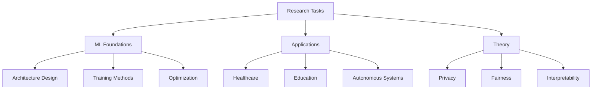

## Overview

The Research benchmark evaluates multi-agent collaboration on **academic research tasks**. It contains **100 tasks** focused on generating novel, feasible research ideas by combining expertise from multiple AI researcher agents with diverse backgrounds and specializations.

## Task Characteristics

### Agent Configuration
- **Number of Agents**: 2
- **Agent Roles**: AI researchers with specialized expertise
- **Collaboration Mode**: Graph-based collaborative ideation
- **Relationship Type**: Peer collaboration

### Environment
- **Type**: Research Collaboration Environment
- **Max Iterations**: Typically 3-5
- **Memory**: Shared or independent memory configurations
- **Tools**: Literature search, idea generation, feasibility analysis

## Research Domains

The 100 research tasks cover cutting-edge AI and ML research areas:

### Machine Learning (40 tasks)
- Deep learning architectures
- Federated learning
- Transfer learning
- Meta-learning
- Reinforcement learning
- Self-supervised learning

### Computer Vision (20 tasks)
- Image generation and manipulation
- Object detection and recognition
- Video analysis
- 3D reconstruction
- Medical imaging

### Natural Language Processing (15 tasks)
- Language models
- Machine translation
- Text classification
- Question answering
- Dialogue systems

### Graph Neural Networks (15 tasks)
- Graph representation learning
- Graph classification
- Node prediction
- Link prediction
- Knowledge graphs

### Specialized Areas (10 tasks)
- Healthcare AI
- Autonomous systems
- Educational technology
- Privacy-preserving ML
- Explainable AI

## Example Tasks

### Task 1: Privacy-Preserving Deep Learning

<Accordion title="View Full Task Description">

**Agent 1 Profile**: Researcher specializing in privacy and security in deep learning, particularly:
- Face manipulation detection
- Federated learning
- Differential privacy
- Dataset condensation
- Deepfake detection
- Privacy-preserving model conversion

**Agent 2 Profile**: Researcher focusing on generative models and data synthesis:
- Generative adversarial networks (GANs)
- Diffusion models
- Data augmentation
- Private data generation
- High-quality synthetic data

**Research Goal**: Generate novel research ideas combining privacy preservation and generative modeling

**Expected Outputs**:
- Novel research direction
- Feasibility analysis
- Potential applications
- Technical challenges
- Evaluation metrics

</Accordion>

### Task 2: Educational AI Systems

<Accordion title="View Full Task Description">

**Agent 1 Profile**: Researcher in educational assessment and learning analytics:
- Automated essay scoring
- Student performance prediction
- Adaptive learning systems
- Educational data mining
- Intelligent tutoring systems

**Agent 2 Profile**: Researcher in large language models and NLP:
- LLMs for education
- Response generation
- Answer grading
- Reading fluency assessment
- Student feedback generation

**Research Goal**: Develop innovative AI-powered educational tools

**Key Focus Areas**:
- Scalable assessment methods
- Personalized learning
- Real-time feedback
- Learning outcome prediction

</Accordion>

### Task 3: Graph Neural Networks for Tabular Data

<Accordion title="View Full Task Description">

**Agent 1 Profile**: Researcher in tabular and graph ML:
- Graph neural networks
- Tabular data modeling
- Out-of-distribution detection
- Feature engineering
- Benchmark development

**Agent 2 Profile**: Researcher in GNN theory and applications:
- Message passing neural networks
- Graph attention mechanisms
- Node and graph classification
- Expressiveness of GNNs
- Graph kernels

**Research Goal**: Bridge tabular and graph-based machine learning

**Research Challenges**:
- Heterogeneous data handling
- OOD generalization
- Scalability
- Interpretability

</Accordion>

## Task Structure

### Research Task Format

```json
{
  "scenario": "research",
  "task_id": 1,
  "coordinate_mode": "graph",
  "agents": [
    {
      "agent_id": "agent1",
      "profile": "Detailed researcher background with publications and expertise areas...",
      "type": "BaseAgent"
    },
    {
      "agent_id": "agent2",
      "profile": "Complementary researcher background...",
      "type": "BaseAgent"
    }
  ],
  "task": {
    "content": "Research collaboration prompt..."
  },
  "metrics": {
    "diversity_of_perspectives": true,
    "novelty": true,
    "feasibility": true,
    "clarity": true
  }
}
```

### Agent Profiles

Each agent profile includes:

1. **Research Background**: Summary of research interests
2. **Key Publications**: Implied through detailed descriptions
3. **Technical Expertise**: Specific methods and frameworks
4. **Domain Knowledge**: Application areas
5. **Methodological Strengths**: Preferred approaches

### Example Agent Profile

```text
I am a researcher dedicated to enhancing the reliability and privacy 
of deep learning models, particularly in sensitive domains such as 
face manipulation detection and federated learning. My recent work 
focuses on developing interpretable models that balance accuracy and 
transparency.

Key Research Areas:
- Feature whitening for model interpretability
- DP-SAD: Diffusion models for private data generation
- M3D: Dataset condensation methods
- Deepfake detection with spatiotemporal transformers
- Privacy-preserving model distillation
- Personalized federated learning

My work aims to bridge the gap between high utility and strong privacy 
in deep learning applications.
```

## Research Ideation Process

### Phase 1: Context Sharing
Agents share their expertise areas and recent research directions

```python
agent1: "I've been working on privacy-preserving techniques in 
federated learning, particularly differential privacy methods."

agent2: "My focus is on generative models, especially diffusion models 
for high-quality data synthesis."
```

### Phase 2: Intersection Identification
Agents identify overlapping interests and complementary strengths

```python
agent1: "Your diffusion model expertise could address the synthetic 
data generation challenge in federated learning."

agent2: "And your differential privacy work could enhance the privacy 
guarantees of generative models."
```

### Phase 3: Idea Generation
Agents collaboratively develop novel research directions

```python
research_idea = {
    "title": "Privacy-Preserving Diffusion Models for Federated Learning",
    "approach": "Combine differential privacy with diffusion models",
    "novelty": "First work to integrate DP with diffusion-based FL",
    "applications": ["Healthcare", "Finance", "Edge computing"]
}
```

### Phase 4: Feasibility Analysis
Agents evaluate technical challenges and required resources

```python
feasibility = {
    "technical_challenges": [
        "Balancing privacy budget with sample quality",
        "Computational overhead of diffusion models",
        "Convergence in federated settings"
    ],
    "required_resources": [
        "Access to private datasets for validation",
        "Significant compute for diffusion training",
        "Expertise in both privacy and generative models"
    ],
    "timeline": "12-18 months"
}
```

## Evaluation Metrics

### Novelty (30%)
- **Originality**: How unique is the research direction?
- **Innovation**: Does it combine ideas in new ways?
- **Advancement**: Does it push the field forward?

### Feasibility (30%)
- **Technical Viability**: Can it be implemented with current technology?
- **Resource Requirements**: Are resources reasonable?
- **Timeline**: Is the project scope appropriate?
- **Risk Assessment**: Are risks identified and manageable?

### Diversity of Perspectives (20%)
- **Integration**: How well are both agents' expertise combined?
- **Complementarity**: Do agents bring different viewpoints?
- **Synthesis**: Is the idea more than the sum of parts?

### Clarity (20%)
- **Communication**: Is the idea clearly articulated?
- **Structure**: Is the proposal well-organized?
- **Detail**: Are key aspects sufficiently described?
- **Coherence**: Do all parts fit together logically?

## Running Research Benchmarks

### Load and Execute a Task

```python
import json
from marble import ResearchEnvironment, MultiAgentSystem

# Load research task
with open('multiagentbench/research/research_main.jsonl') as f:
    tasks = [json.loads(line) for line in f]

task = tasks[0]

# Initialize research collaboration
mas = MultiAgentSystem(
    agents=task['agents'],
    environment=ResearchEnvironment(
        max_iterations=task['environment']['max_iterations']
    ),
    relationships=task['relationships']
)

# Run ideation
result = mas.run()

# Extract research idea
print(f"Research Idea: {result.idea['title']}")
print(f"Novelty Score: {result.scores['novelty']:.2f}")
print(f"Feasibility Score: {result.scores['feasibility']:.2f}")
```

### Evaluate Research Quality

```python
from marble.benchmarks.research import ResearchEvaluator

evaluator = ResearchEvaluator(llm="gpt-4o")

scores = evaluator.evaluate(
    research_idea=result.idea,
    agent_profiles=task['agents'],
    conversation_history=result.messages
)

print(f"Novelty: {scores.novelty:.2f}")
print(f"Feasibility: {scores.feasibility:.2f}")
print(f"Diversity: {scores.diversity:.2f}")
print(f"Clarity: {scores.clarity:.2f}")
print(f"Overall: {scores.overall:.2f}")
```

### Batch Evaluation

```python
from marble.benchmarks import BenchmarkRunner

runner = BenchmarkRunner(
    benchmark='research',
    model='gpt-4o',
    num_tasks=100,
    output_dir='results/research'
)

results = runner.run_all()

# Analyze results
print(f"Average Novelty: {results.avg_novelty:.2f}")
print(f"Average Feasibility: {results.avg_feasibility:.2f}")
print(f"Collaboration Quality: {results.avg_diversity:.2f}")
```

## Example Research Outputs

### High-Quality Research Idea

```markdown
# Privacy-Preserving Federated Diffusion Models

## Abstract
We propose a novel framework combining differential privacy (DP) with 
diffusion models for federated learning (FL), enabling high-quality 
synthetic data generation while preserving privacy.

## Key Innovation
- First integration of DP mechanisms with diffusion-based FL
- Novel noise injection strategy preserving diffusion properties
- Theoretical privacy guarantees with empirical utility validation

## Technical Approach
1. Client-side diffusion model training with DP-SGD
2. Private aggregation using secure multi-party computation
3. Adaptive noise scheduling for privacy-utility trade-off

## Applications
- Healthcare: Synthetic patient data for model training
- Finance: Privacy-preserving synthetic transactions
- IoT: Edge device data augmentation

## Evaluation Plan
- Privacy: Theoretical DP guarantees, empirical privacy auditing
- Utility: FID scores, downstream task performance
- Efficiency: Communication costs, computation time

## Expected Challenges
- Balancing privacy budget across diffusion steps
- Convergence in heterogeneous federated settings
- Computational overhead at edge devices

## Timeline: 18 months
- Months 1-6: Algorithm design and theoretical analysis
- Months 7-12: Implementation and benchmark evaluation
- Months 13-18: Application studies and paper writing
```

## Common Research Patterns

### Pattern 1: Method Transfer
Applying techniques from one domain to another

**Example**: Transfer graph neural network techniques to tabular data

### Pattern 2: Problem Reformulation
Reframing existing problems with new perspectives

**Example**: Treat fairness in ML as a graph partitioning problem

### Pattern 3: Integration
Combining complementary approaches

**Example**: Merge differential privacy with federated learning

### Pattern 4: Scale Adaptation
Adapting methods to different scales or settings

**Example**: Efficient transformers for edge devices

### Pattern 5: Domain Application
Applying general methods to specific domains

**Example**: Apply LLMs to medical diagnosis

## Best Practices

### For Research Ideation
1. **Start broad**, then narrow to specific directions
2. **Identify gaps** in current literature
3. **Consider feasibility** early in the process
4. **Leverage complementary expertise** from both agents
5. **Validate novelty** against recent work

### For Collaboration
1. **Share knowledge** proactively
2. **Build on each other's ideas** rather than competing
3. **Challenge assumptions** constructively
4. **Synthesize** rather than compromise
5. **Document reasoning** for all decisions

### For Evaluation
1. **Define clear metrics** upfront
2. **Consider multiple perspectives** (novelty, feasibility, impact)
3. **Assess risks** realistically
4. **Plan evaluation** methodology
5. **Estimate resources** accurately

## Task Difficulty Levels

| Level | Tasks | Characteristics |
|-------|-------|----------------|
| **Straightforward** | 1-30 | Well-defined problem, clear solution path |
| **Moderate** | 31-70 | Requires creative integration, some ambiguity |
| **Challenging** | 71-100 | Novel problem formulation, high uncertainty |

## Domain Coverage



## Related Benchmarks

<CardGroup cols={2}>
  <Card title="Coding Benchmarks" icon="code" href="/benchmarks/coding">
    Implement research ideas as working systems
  </Card>
  <Card title="Database Benchmarks" icon="database" href="/benchmarks/database">
    Data management for research applications
  </Card>
</CardGroup>